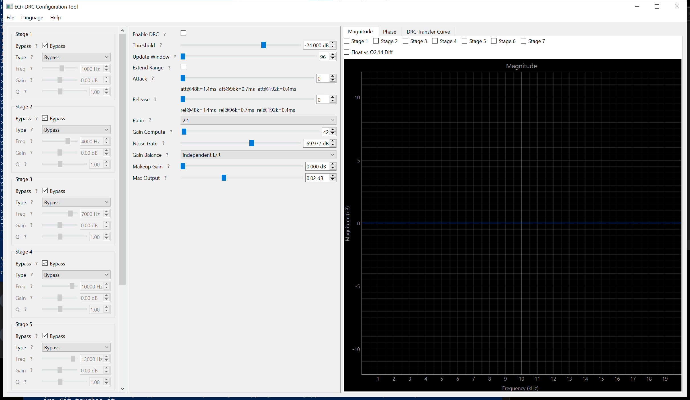

# eq_drc_tool

PySide6 GUI for configuring SoundWire DAC 7-band biquad EQ and DRC with
real-time frequency response visualization and register-write script generation.

## Features

- **7-band parametric EQ** — peaking, notch, lowshelf, highshelf, HPF, LPF with
  RBJ Audio EQ Cookbook biquad coefficient generation
- **Dynamic Range Compression** — threshold, ratio, attack/release, makeup gain,
  noise gate, and output limiting
- **Real-time visualization** — magnitude and phase frequency response plots
  (20 Hz–20 kHz, linear or log x-axis) with per-band curve overlay and float-vs-Q2.14
  quantization comparison
- **DRC transfer curve** — static input/output level mapping with threshold,
  compression ratio, and output clamp
- **Register-write script export** — generates `.bat` files with PowerShell
  `SdwRegisterTool` commands for direct hardware configuration
- **JSON config import/export** — save and restore EQ+DRC presets
- **English / Chinese** — auto-detects OS language, switchable at runtime

## Screenshot



The GUI is a three-panel horizontal layout: the **EQ panel** on the left holds
7 band strips with sliders, filter type selectors, and per-band bypass; the
**DRC panel** in the center provides threshold, ratio, attack/release, makeup
gain, noise gate, and output limiting controls; the **plot area** on the right
shows real-time magnitude, phase, and DRC transfer curve tabs.

## Requirements

- Python >= 3.12
- PySide6 >= 6.11
- pyqtgraph >= 0.14
- numpy >= 2.5

## Quick Start

```
pip install -r requirements.txt
python -m src.main
```

## Build Standalone .exe

```
pip install pyinstaller
pyinstaller scripts/eq_drc_tool.spec
# Output: dist/eq_drc_tool.exe (~64 MB, no Python installation needed)
```

## Architecture

```
src/
├── domain/           Pure business logic, value objects, ports
│   ├── eq/           FilterParams, BiquadCoefficients, DesignedCoefficients,
│   │                 FilterDesigner (port), frequency_response, quantizer
│   ├── drc/          DRCParams, DrcRegisters, DRCDesigner (port), transfer_curve
│   └── script/       RegisterWrite, register_map
├── application/      Orchestration, session state
│   ├── ports.py      ScriptFormatter, Observer protocols
│   ├── eq_session.py Observable 7-band state with per-band bypass
│   ├── drc_session.py Observable DRC state
│   └── script_composer.py  EQ + DRC -> list[RegisterWrite]
├── adapters/         GUI, file I/O, concrete implementations
│   ├── designers/    RBJDesigner, HardwareDrcDesigner
│   ├── scripts/      BatScriptFormatter, config_io
│   └── gui/          MainWindow, EQPanel, DRCPanel, PlotCanvas, i18n
└── main.py           Composition root (dependency injection)
```

Dependencies point inward: adapters -> application -> domain. The domain layer
imports nothing from PySide6, pyqtgraph, or the filesystem.

## Testing

```
python -m pytest test/ -v
```

- `test_quantizer.py` — Q2.14 quantizer math + inline golden RBJ validation
- `test_register_map.py` — address generation
- `test_protocol.py` — FSM rules
- `test_integration.py` — full pipeline: params -> designer -> .bat

See [TODO.md](TODO.md) for known test coverage gaps.

## License

MIT — Copyright (c) 2026 FrozenEelFanGirl & Senary
